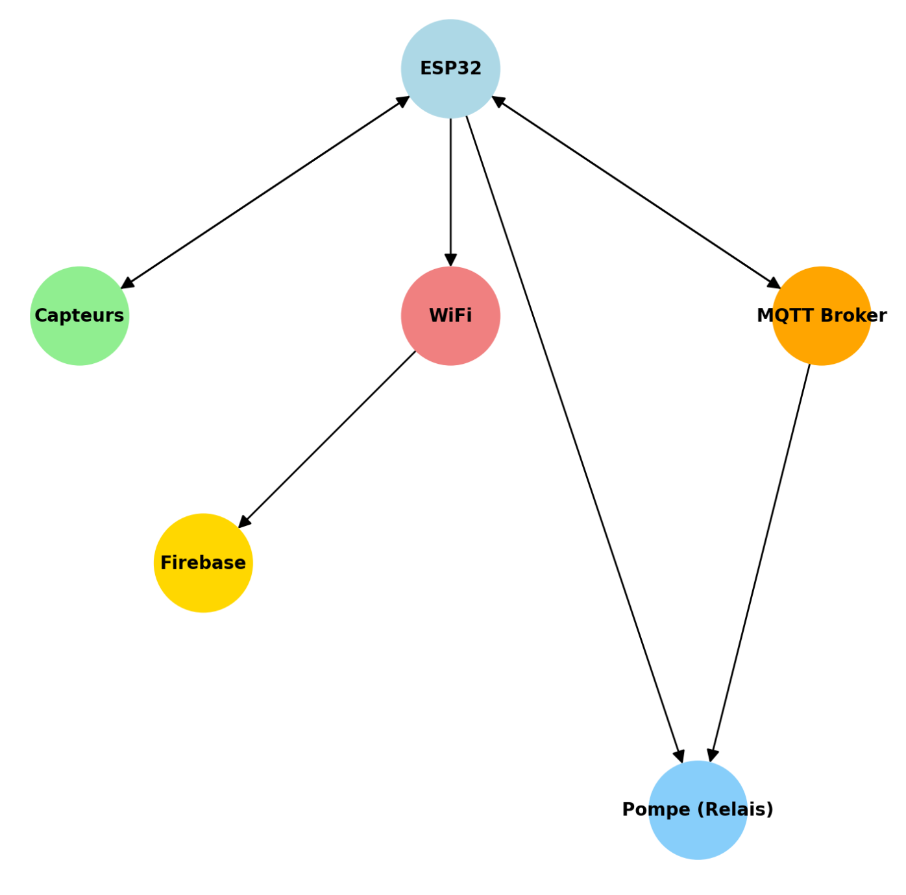

# 🌱 Smart Plant - Système d'arrosage connecté

## 📖 Présentation du projet

Le projet **Smart Plant** est un système d'arrosage automatique intelligent qui permet de surveiller et de réguler l'humidité du sol, la température, le niveau d'eau et la luminosité autour d'une plante.

Il permet un **arrosage automatique adaptatif** en fonction des capteurs, ainsi qu'un **contrôle à distance** via **MQTT**.

## 🎯 Fonctionnalités principales

✅ **Arrosage automatique** : La pompe s'active si l'humidité du sol est trop basse et s'arrête lorsque l'humidité est suffisante.  
✅ **Gestion intelligente de l'eau** : Si le niveau d'eau est trop bas, l'arrosage est réduit ou annulé pour éviter un pompage à sec.  
✅ **Contrôle manuel à distance** : Via MQTT, l'utilisateur peut activer la pompe pour une durée définie.  
✅ **Envoi des données vers Firebase** : Données mises à jour toutes les 60 secondes ou à chaque changement significatif.  
✅ **Logs détaillés pour la démo** : Affichage des capteurs toutes les 30s et journalisation des activations.

---

## 🏗 Architecture du projet

Le projet repose sur l'ESP32 et utilise plusieurs technologies pour assurer la communication et le contrôle :

📡 **WiFi** : Connexion automatique et reconnexion en cas de coupure.  
🔥 **Firebase** : Stockage et affichage des données en temps réel.  
📩 **MQTT** : Activation de la pompe à distance via un broker MQTT.  
💧 **Capteurs** : Humidité du sol, Température, Luminosité, Niveau d'eau.  
⚙ **Pompe** : Activation selon l'analyse des capteurs ou sur commande MQTT.



---

## 🚀 Installation et configuration

### **1️⃣ Prérequis**

- ESP32
- Capteurs : DHT22, capteur d'humidité du sol, capteur de niveau d'eau, photorésistance
- Module relais pour la pompe
- Serveur MQTT (Mosquitto ou autre)
- Base de données Firebase

### **2️⃣ Flash du code sur l'ESP32**

1. Installer **PlatformIO** ou l'IDE Arduino.
2. Installer les bibliothèques requises :
   ```cpp
   #include <WiFiManager.h>
   #include <FirebaseESP32.h>
   #include <PubSubClient.h>
   ```
3. Configurer le fichier `platformio.ini` (si PlatformIO est utilisé).
4. Flasher le code sur l'ESP32.

### **3️⃣ Configuration WiFi et MQTT**

- **WiFi** :

  - Si l'ESP32 ne trouve pas de réseau enregistré, il crée un **point d'accès WiFi** nommé **"ESP32_Config"**.
  - Connectez-vous à ce réseau via un smartphone ou un PC.
  - Ouvrez un navigateur et accédez à **`votre réseau`** pour configurer le WiFi.
  - Après configuration, l'ESP32 redémarre et se connecte automatiquement au réseau enregistré.
  - **Si besoin de réinitialiser le WiFi**, il faudra supprimer les informations stockées sur l'ESP32.

- **MQTT** : Assurez-vous que votre broker MQTT tourne sur `votre réseau` ou en ligne.

### **4️⃣ Utilisation du projet**

📡 **Affichage des données capteurs toutes les 30s**  
📤 **Envoi vers Firebase toutes les 60s ou si changement significatif**  
💧 **Activation automatique de la pompe selon l'humidité du sol**  
📩 **Commande manuelle de la pompe via MQTT (ex: envoyer "10" pour 10 secondes)**

### **5️⃣ Libération de la mémoire Flash (Réinitialisation complète de l'ESP32)**

Si vous souhaitez **supprimer toutes les données enregistrées en mémoire (WiFi, préférences, etc.)**, vous pouvez exécuter le code suivant dans un sketch Arduino :

```cpp
#include <Preferences.h>

void setup() {
    Serial.begin(115200);
    Preferences preferences;
    preferences.begin("wifi_config", false);
    preferences.clear(); // Supprime toutes les préférences enregistrées
    preferences.end();
    delay(3000);
    ESP.restart();
}

void loop() {}
```

📌 **Après l'exécution de ce code :**

- Toutes les configurations stockées seront effacées.
- L'ESP32 redémarrera comme neuf, prêt à être reconfiguré.
- Il proposera à nouveau le WiFi **"ESP32_Config"** pour une nouvelle configuration.

## 🛠 Scénarios de test recommandés

### **Test 1 : Activation automatique**

➡ Baisser l'humidité du sol et vérifier que la pompe s'active avec une durée adaptée.

### **Test 2 : Niveau d'eau bas**

➡ Simuler un réservoir vide et vérifier que l'arrosage est annulé.

### **Test 3 : Commande MQTT**

➡ Envoyer `"10"` via MQTT et vérifier que la pompe tourne pendant 10 secondes puis s'arrête.

### **Test 4 : Logs et affichage**

➡ Vérifier que les logs affichent les valeurs correctement et que Firebase est bien mis à jour.

---

## 📌 Améliorations possibles

🔹 Interface Web ou App mobile pour visualiser les données.
🔹 Ajout d'une alerte email ou notification push si le réservoir d'eau est vide.
